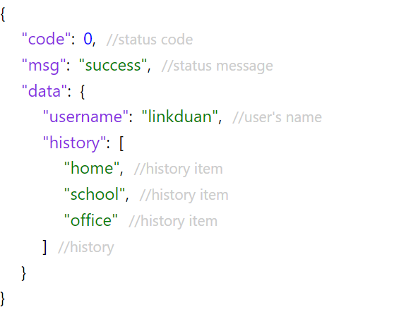

# Pretty Json View 
This is a react component for displaying json

## Get Started
### Install
```bash
npm i -d pretty-json-view
```

### Usage
```jsx harmony
import {Component} from 'react';
import PrettyJsonView from 'pretty-json-view';
import "pretty-json-view/style.css"

export class Hello extends Component {
    render(){
        let data = {
            code: 0,
            msg: "success",
            data: {
                "username": "linkduan",
                "history": ["home", "school", "office"]
            }
        };
        // Optional: tagInfo will show at then end of json fields
        let tagInfo = {
            "code": "status code",
            "msg": "status message",
            "data.username": "user's name",
            "data.history": "history",
            "data.history.$": "history item"        
        };
        return <div>
            <PrettyJsonView data={data} tagInfo={tagInfo}/>
        </div>
    }
}
```

It will show like this:
